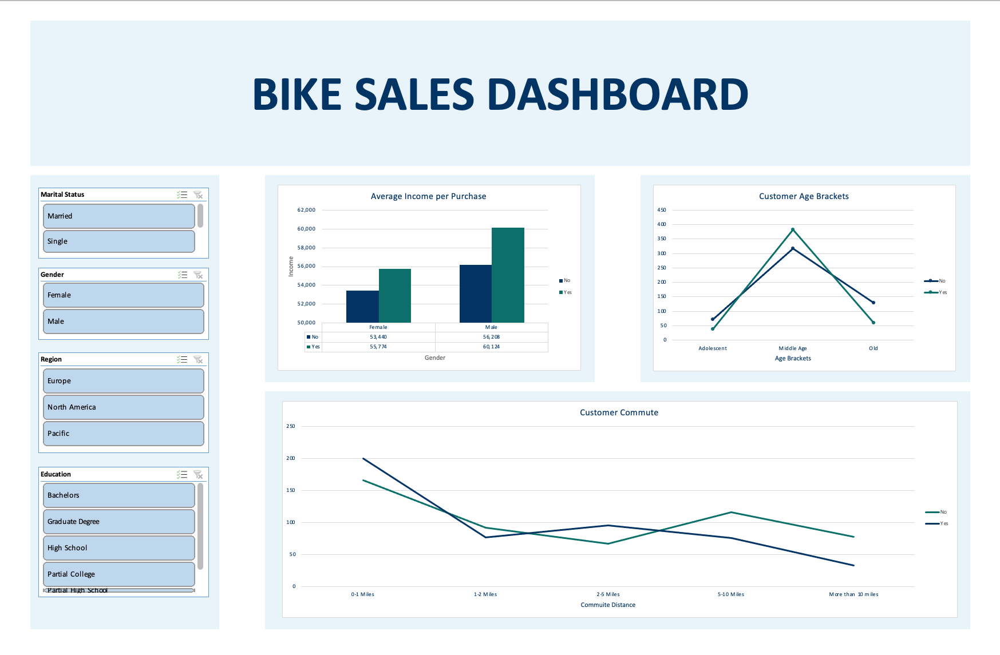

# 🚲 Bike Sales Dashboard

## 📝 Overview  
This project visualizes **bike sales data** using **Microsoft Excel**. The dashboard provides key insights into customer demographics, income, and commuting patterns. It offers interactive filtering options, helping identify trends in customer behavior and sales.

---

## 🖼️ Dashboard Preview  

---

## 🚀 Key Features  
- 📊 **Customer Demographics Analysis:** Explore sales trends based on marital status, gender, and age groups.  
- 💰 **Income Insights:** Analyze average income per purchase, with comparisons across gender and marital status.  
- 🚗 **Commute Patterns:** Understand the relationship between customer commute distance and bike sales.  
- 🎛️ **Interactive Filters:** Filter data by marital status, gender, region, and education to gain targeted insights.

---

## 📊 Insights Summary  
- **Average Income per Purchase:**  
  - Female: $5,774  
  - Male: $6,124  
- **Customer Age Brackets:**  
  - Adolescent: Highest number of sales  
  - Middle Age: Strong consistent sales  
  - Old: Moderate sales  
- **Commute Distance Trends:**  
  - Customers with shorter commutes (0-0.4 miles) tend to buy more bikes.  
  - Commute distance of more than 30 miles shows a decreasing trend in sales.

---

## 🛠️ Tools & Technologies  
- **Microsoft Excel**  
- **Dataset:** Custom bike sales data  
- **Visuals Used:** Bar charts, line graphs, and pivot tables  
- **Features Implemented:** Interactive filtering, data aggregation, and trend analysis 
