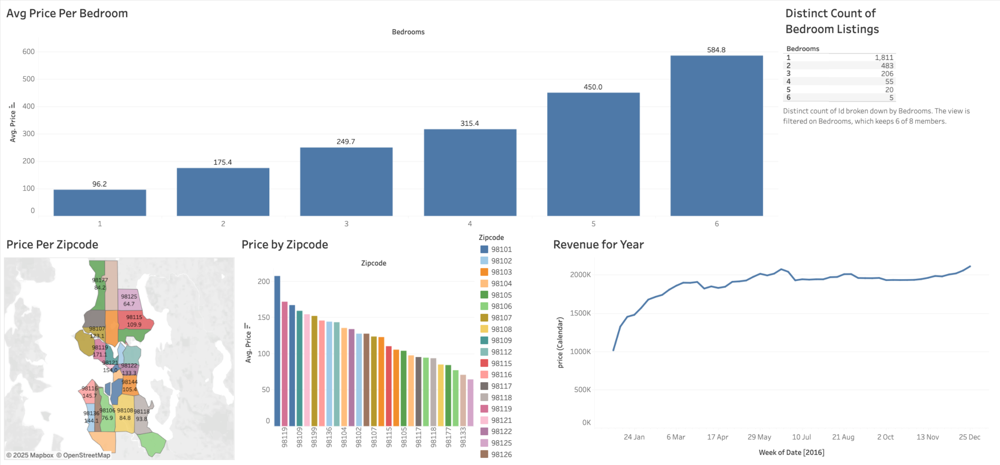

# 🏠 Airbnb Seattle Market Analysis Dashboard

## 📊 Project Overview
This project visualizes Airbnb listing data for Seattle using **Tableau**.  
The dashboard provides insights into pricing trends, revenue distribution, and neighborhood performance.  
It helps identify how listing characteristics such as the number of bedrooms and zip codes affect average prices and annual revenue.

---

## 📈 Dashboard Preview

🔗 **[View Interactive Dashboard on Tableau Public →](https://public.tableau.com/app/profile/touhid.imam/viz/airbnb-dashboard_17542058189720/Dashboard1)**

---

## 🔍 Key Insights
- **Average Price per Bedroom:**  
  As the number of bedrooms increases, the average listing price rises significantly, with 6-bedroom listings showing the highest average price.  

- **Price by Zip Code:**  
  Zip codes such as `98119` and `98109` show higher average prices compared to other areas.  

- **Revenue Trend for the Year:**  
  The overall revenue trend shows consistent growth throughout the year, with peaks during the summer months.  

---

## 🛠️ Tools & Technologies
- **Tableau** – for interactive dashboard creation and visualization  
- **Airbnb Seattle Dataset (Kaggle)** – for listing and pricing data  
- **Excel / CSV** – for preprocessing and cleaning raw data  

---

## 📁 Project Structure
