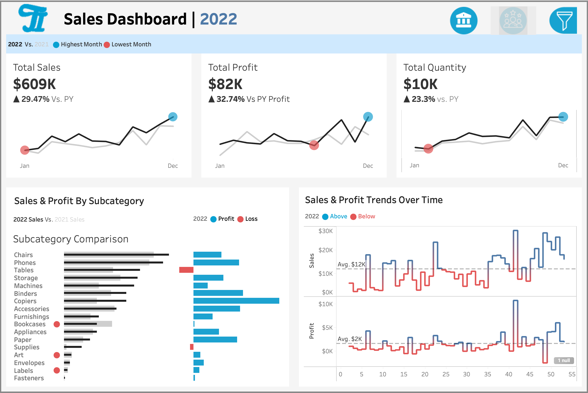

# 📊 Sales and Profit Analysis Dashboard

## 📝 Overview  
This Tableau project visualizes **sales and profit performance across multiple years** with interactive filters.  
It provides insights into total sales, profit, and quantity trends, helping identify growth opportunities and areas of improvement.

---

## 🖼️ Dashboard Preview  

---

## 🚀 Key Features  
- 📅 **Multi-Year Comparison:** Analyze performance trends by year.  
- 💰 **KPIs Overview:** Displays total sales, profit, and quantity with year-over-year growth.  
- 📦 **Subcategory Breakdown:** View profit/loss across product categories.  
- 📈 **Trend Analysis:** Track sales and profit trends over time.  
- 🎛️ **Interactive Filters:** Explore data dynamically for better insights.  

---

## 📊 Insights Summary  
- **Total Sales:** $609K → ⬆️ 29.47% vs. PY  
- **Total Profit:** $82K → ⬆️ 32.74% vs. PY  
- **Total Quantity:** 10K → ⬆️ 23.3% vs. PY  
- Top-performing subcategories: **Chairs, Phones, Tables**  
- Loss observed in: **Tables, Furnishings**

---

## 🛠️ Tools & Technologies  
- **Tableau Desktop / Tableau Public**  
- **Dataset:** Sample Superstore or custom sales dataset  
- **Visuals Used:** Line charts, bar charts, KPI cards, and trend graphs  

